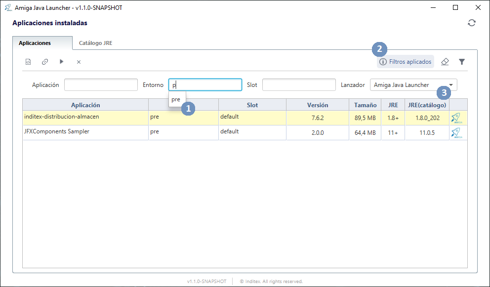
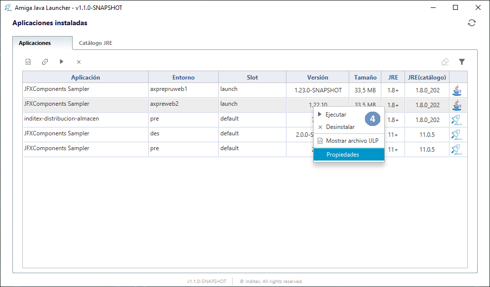
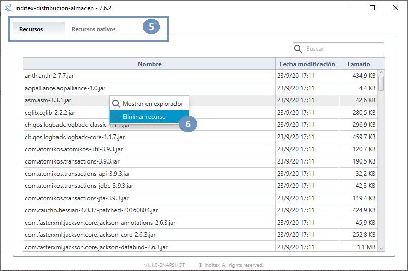

[[v1_1_0]]
= Release notes versión 1.1.0

== Mejoras

* El idioma por defecto de la aplicación ha dejado de ser el español para ser el inglés en caso de que no se detecte el
locale del sistema o no se encuentre la variable `amglauncher.locale` definida en las variables de entorno.
* Se introduce la opción _-install_, que permite instalar una aplicación referenciado su archivo descriptor. Esto no provocará el lanzamiento de la aplicación.
* Se introduce la opción _-silent_, que usada con -install permite realizar una instalación silenciosa en segundo plano.

=== Visor de aplicaciones

* Los campos de texto para filtros pasan a ser autocompletables si el texto de entrada coincide con algún valor de
 la columna de búsqueda `(1)`.

* Añadida una etiqueta para identificar cuándo las aplicaciones están siendo filtradas aunque el panel de filtros
se encuentre contraído `(2)`.

* Nuevo campo en el panel de filtros para filtrar las aplicaciones instaladas por tipo de lanzador utilizado `(3)`.

* Las siguientes acciones que actúan sobre aplicaciones instaladas: Ejecutar la aplicación, desinstalar y mostrar el
fichero IJLP, ahora también están disponibles desde el menú contextual de cada elemento en la tabla de aplicaciones
instaladas `(4)`.

* Se ha agregado una nueva funcionalidad que permite visualizar los recursos de las aplicaciones instaladas y los
categoriza según su tipo (recurso, recurso nativo, recurso modular) `(5)`, además se agregan las acciones de visualizar el
recurso en el explorador de archivos y eliminar dicho recurso `(6)`. Esta funcionalidad es accesible mediante la opción
`Propiedades` del menú contextual de una aplicación en la tabla de aplicaciones instaladas.

* Se ha movido fuera del panel contraíble el botón que permite limpiar filtros establecidos y se deshabilitará cuando
no existan filtros aplicados, todo esto con el objetivo de mejorar la usabilidad.

* El peso de las aplicaciones instaladas que se muestra en la tabla se pintará en la unidad de medida más grande que
pueda representar no siendo nunca la parte entera de la cantidad menor que uno.

La siguiente pantalla se puede visualizar seleccionando la opción "Propiedades" desde el menú contextual de una aplicación instalada:

=== Devmode
* Se ha agregado un modo de trabajo para desarrollo llamado `devmode`, que permite a los desarrolladores que dispongan del permiso adecuado ejecutar desde consola aplicaciones firmadas con un certificado especial que carece de validez oficial. Además, permite ejecutarlas a través de protocolos no seguros como `http://` ó `file://` y eludir las restricciones de seguridad.

== Corrección de errores

=== Visor de aplicaciones

* No se reflejaban correctamente los datos de aplicaciones instaladas en la tabla después de desinstalar una aplicación
cuando había algún filtro aplicado.

* No se concatenaban/acumulaban los filtros establecidos en el panel.

* Se deshabilitaban las acciones que actúan sobre las aplicaciones instaladas si los datos se encontraban filtrados
incluso aunque ya hubiese un elemento seleccionado.
